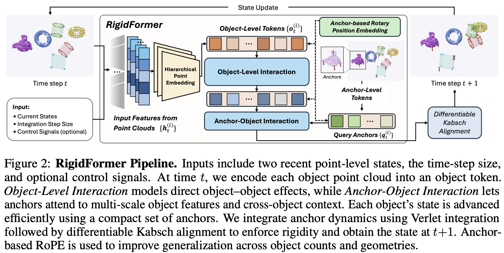

</img>

## Rigidformer (wip)

Implementation of [RigidFormer](https://arxiv.org/abs/2605.09196), Learning Rigid Dynamics using Transformers, out of MIT and Meta

## Install

```bash
$ pip install rigidformer
```

## Usage

```python
import torch
from rigidformer import Rigidformer

# instantiate model

model = Rigidformer(
    dim = 256,
    dim_head = 192,
    heads = 8,
    object_self_attn_depth = 4,
    anchor_cross_attn_depth = 4,
    num_anchors = 4,
    object_hidden_layers = (0, 1, 2, 4),
    vertex_properties_dim = 3
)

# mock inputs

delta_times = torch.randn(2)
vertex_properties = torch.randn(2, 4, 3)    # (batch, num_objects, d_attr)
object_pos = torch.randn(2, 4, 64, 3)       # (batch, num_objects, num_points, 3)
object_pos_prev = torch.randn(2, 4, 64, 3)
object_pos_next = torch.randn(2, 4, 64, 3)

# training

loss, loss_breakdown = model(
    delta_times = delta_times,
    vertex_properties = vertex_properties,
    object_pos = object_pos,
    object_pos_prev = object_pos_prev,
    object_pos_next = object_pos_next  # target
)

loss.backward()

# if `object_pos_next` not passed in, will return predictions

pred = model(
    delta_times = delta_times,
    vertex_properties = vertex_properties,
    object_pos = object_pos,
    object_pos_prev = object_pos_prev,
)

assert pred.object_pos_next.shape == object_pos.shape

# rollout multiple steps with a wrapper

from rigidformer import RigidformerRolloutWrapper

wrapper = RigidformerRolloutWrapper(model)

rollout_positions = wrapper(
    num_steps = 10,
    delta_times = delta_times,
    vertex_properties = vertex_properties,
    object_positions = [object_pos_prev, object_pos]
)

# rollout_positions is a list of length 12 tensors of shape (batch, num_objects, num_points, 3)
# includes the 2 initial positions
```

## Citations

```bibtex
@misc{dou2026rigidformerlearningrigiddynamics,
    title   = {RigidFormer: Learning Rigid Dynamics using Transformers},
    author  = {Zhiyang Dou and Minghao Guo and Haixu Wu and Doug Roble and Tuur Stuyck and Wojciech Matusik},
    year    = {2026},
    eprint  = {2605.09196},
    archivePrefix = {arXiv},
    primaryClass = {cs.CV},
    url     = {https://arxiv.org/abs/2605.09196},
}
```
